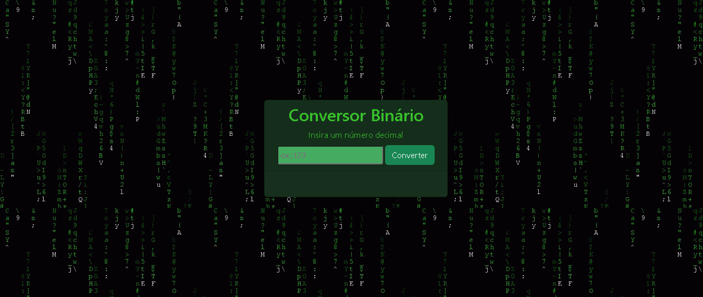

# Conversor Binário Matrix
<p align="center">Conversor de números decimais para binário. </p>
<h4 align="center"> Status do projeto: Concluído.</h4>

### Tabela de conteudo

<p align="center">
<a href="#funcionalidades">funcionalidades</a> • 
<a href="#Demostração-da-Aplicação">Demostração</a> • 
<a href="#Como-executar-o-projeto">como Executar</a> • 
<a href="#Tecnologias-utilizadas">Tecnologias</a> •   
<a href="#autor">Autor</a> •
<a href="#licenc-a">Licença</a> 
</p>

### funcionalidades

- [x] Identificar o número inserido;
- [x] Efetuar a conversão;
- [x] Exibir no card.

### Demostração da Aplicação
* Inserir o número binário para conversão;
* Clicar no botão 'converter';
* Visualizar o resultado no card abaixo.


### Como executar o projeto

Antes de começar, você vai precisar ter instalado em sua máquina as seguintes ferramentas:

Além disto é bom ter um editor para trabalhar com o código como [VSCode](https://code.visualstudio.com/)

```bash
# Clone este repositório
$ git clone <>

# Acesse a pasta do projeto no terminal/cmd
$ cd ...

# Execute a aplicação 
$ index.html ou server live(plugin do vscode)

```


### Tecnologias utilizadas

* HTML
* JavaScritp
* Bootstrap

### Autor
Feito com ❤️ por Lai Campelo 👋🏽 Entre em contato!

email: laihanne.campelo@gmail.com

### Licença
MIT License